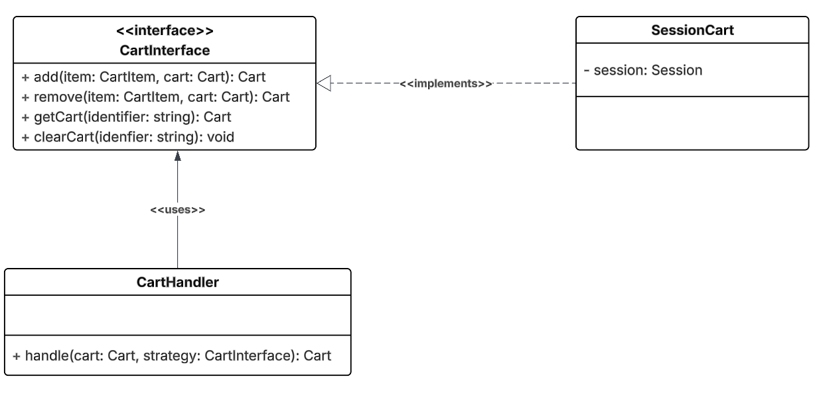
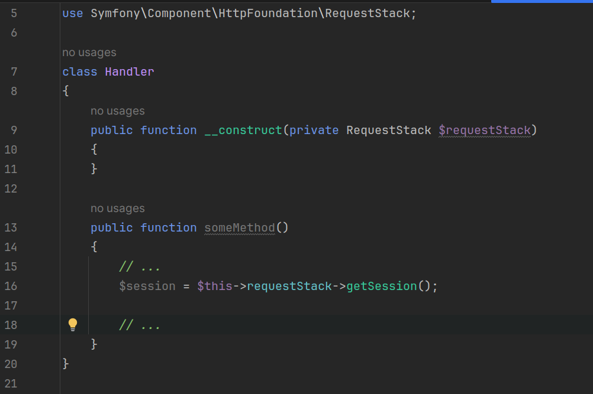
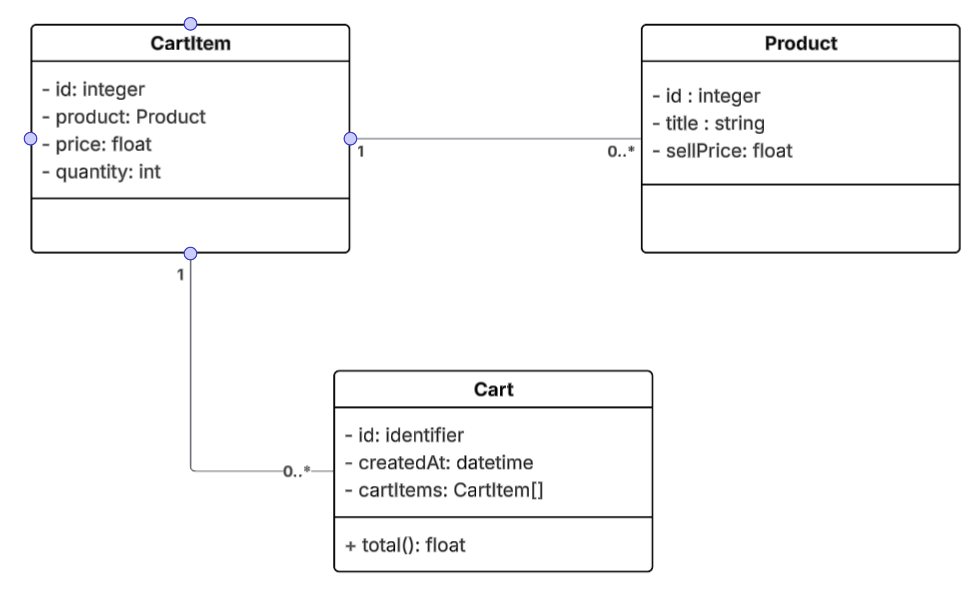
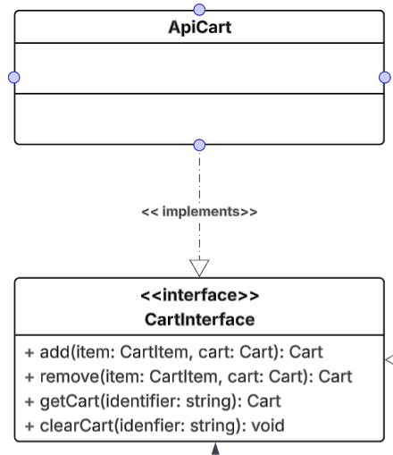

# Etape 3

Cette étape a pour but de manipuler les différents formulaires dans votre site e-commerce.

## Ajouter un produit au panier 

Cette partie va se concentrer sur [files/product_details.html](files/product_details.html). L’objectif est de permettre l’ajout d’un article au panier.

Dans l’étape [précédente](etape02.md), vous avez créé les formulaires du site (ajouter au panier, se connecter, créer un compte…).

### Travail demandé:

- Nous allons gérer le panier dans la session.

- Le code doit respecter les principes SOLID.

- Vous devez respecter l’architecture suivante :

- `CartHandler` : reçoit une instance d’un DTO ou d’une entité Cart, puis la gère en utilisant une stratégie (dans cet exemple, c’est SessionCart).

- Rappel : la manipulation des sessions en Symfony se fait de la manière suivante :

- Implémentez toutes les méthodes nécessaires en respectant l’interface `CartInterface`. Cette interface définit le comportement que chaque gestionnaire de panier doit suivre.

- Une version minimale du diagramme de classes des entités à créer est :

#### Votre code repecte t il SOLID ?

- Pour vérifier, ajoutons une stratégie (classe) qui implémente l’interface CartInterface.

- Cette classe simulera la manipulation du panier via une API. Ici, il n’est pas demandé de développer les API ni d’écrire du vrai code. Vous pouvez simplement utiliser des appels à dd() dans le corps de vos méthodes pour effectuer des tests.

- Que se passe-t-il si vous testez votre code ?

- Corrigez votre code : utilisez l’attribut `#[Autowire]`.

- Vous devez utiliser l'injection de dépendences vu dans le cours. 